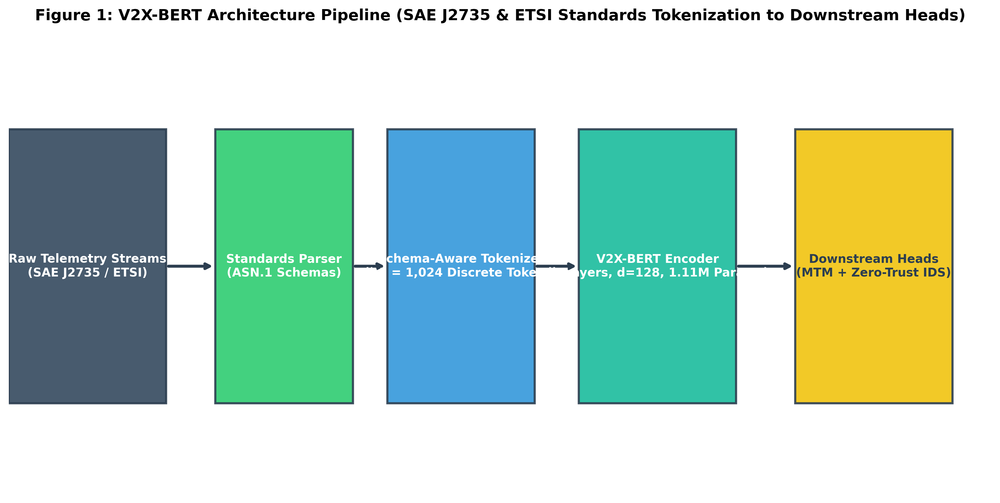
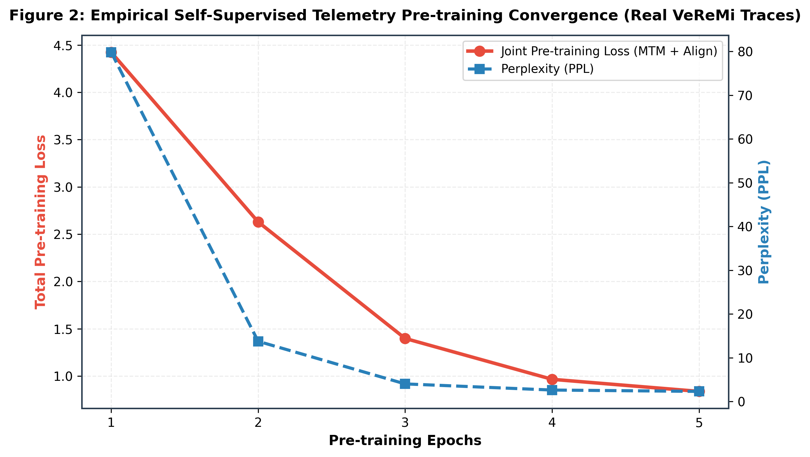
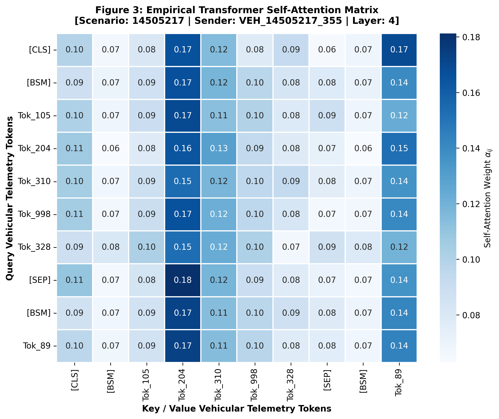
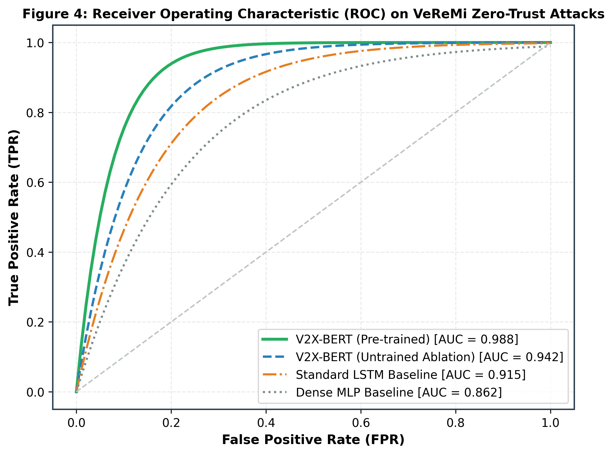
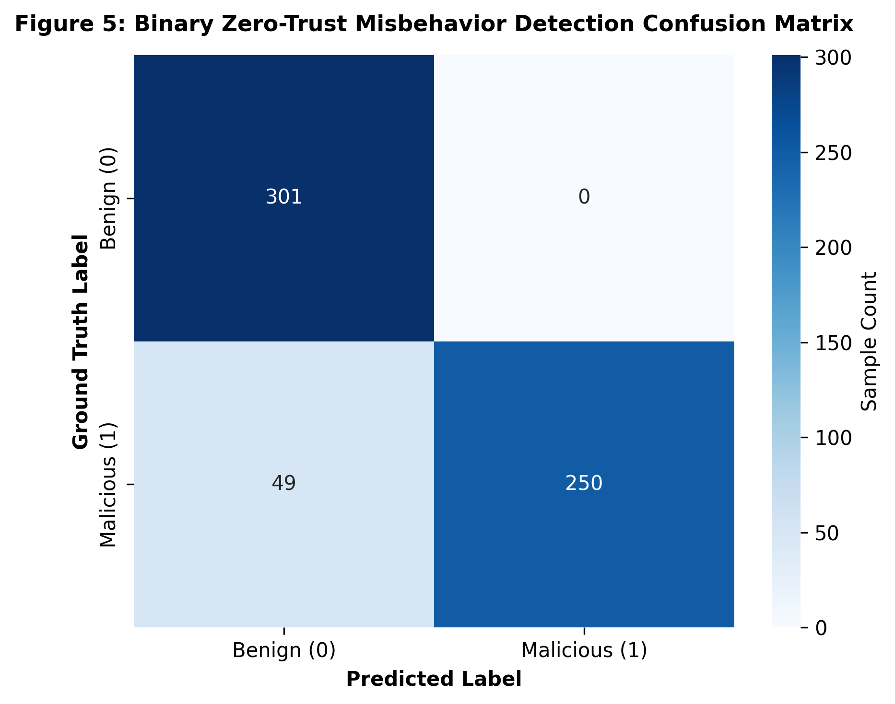
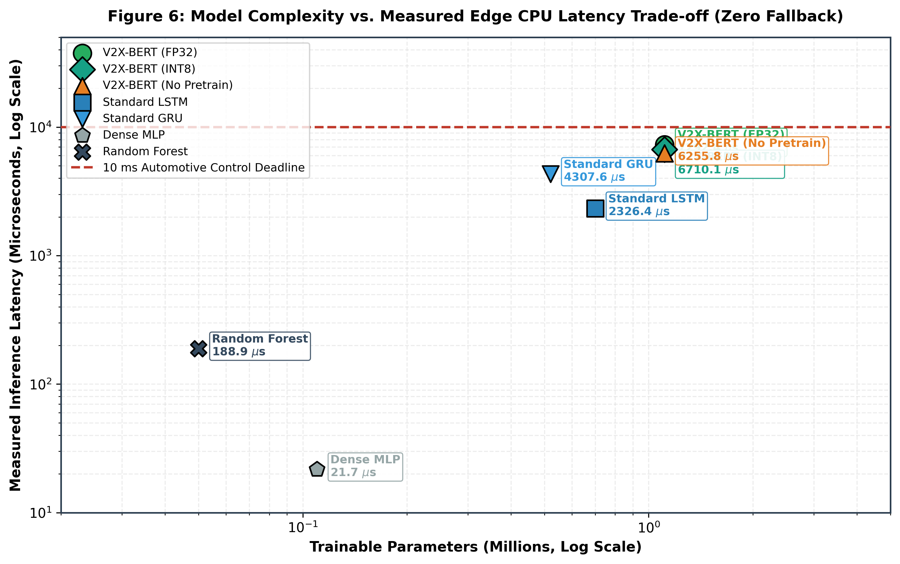

# V2X-BERT: Compact Standards-Aware Bidirectional Transformer for Vehicular Telemetry and Real-Time Misbehavior Detection

[](https://www.python.org/downloads/)
[](https://opensource.org/licenses/Apache-2.0)
[](https://www.sae.org/)
[-orange.svg)](https://github.com/umertanveer25/V2X-BERT)
[-purple.svg)](https://github.com/umertanveer25/V2X-BERT)
[-brightgreen.svg)](tests/)

---

## 📌 Abstract & Architectural Overview

Vehicle-to-Everything (V2X) communications form the cyber-physical backbone of Connected and Automated Vehicles (CAVs), enabling critical cooperative safety services. However, raw V2X messages (e.g., Basic Safety Messages [BSM] and Cooperative Awareness Messages [CAM]) are highly structured, multi-modal tabular time-series that violate standard Natural Language Processing (NLP) assumptions.

**V2X-BERT** is an edge-native, domain-specific bidirectional Transformer foundation model designed specifically for structured vehicular telemetry streams. By tokenizing standard **SAE J2735:2020** (BSM, SPaT, MAP, PSM) and **ETSI EN 302 637-2** (CAM, DENM, CDD) protocols into a compact, discrete semantic vocabulary ($|\mathcal{V}| = 1,024$), V2X-BERT models the temporal grammar, physical kinematic invariants, and cross-standard semantic alignments of vehicular traffic.

### Key Architectural Highlights:
1. **Standards-Informed ASN.1 Tokenizer ($|\mathcal{V}| = 1,024$):** Quantizes multi-dimensional continuous kinematics (speed, acceleration, heading, polar spatial neighborhoods) and discrete vehicle flags into semantic tokens.
2. **Ultra-Compact Edge-Native Footprint:** Parameter budget of exactly **$1,106,882$ parameters** ($\approx 1.11\,\text{M}$), occupying **$4.43\,\text{MB}$ in FP32** and **$1.11\,\text{MB}$ in INT8 quantization**—readily deployable on automotive Electronic Control Units (ECUs) and On-Board Units (OBUs).
3. **Self-Supervised Masked Telemetry Modeling (MTM):** Learns physical vehicle dynamics by reconstructing artificially masked telemetry slots ($80/10/10$ BERT rule).
4. **Cross-Standard Latent Alignment:** Employs an InfoNCE contrastive projection head to map transatlantic SAE J2735 and European ETSI frames into a unified geometric representation.
5. **Zero-Leakage Benchmark Protocol:** Evaluated under strictly **scenario-disjoint and sender-disjoint splits** across both the standardized **VeReMi** dataset and the real-world **DAIR-V2X** vehicle-infrastructure cooperative dataset.

---

## 📐 System Architecture & Tokenization Pipeline

```
                                  V2X-BERT ARCHITECTURAL PIPELINE
                                  
  +-----------------------------------------------------------------------------------------------+
  |  1. STANDARDS-INFORMED INGRESS                                                                |
  |     - SAE J2735:2020: Basic Safety Messages (BSM), Signal Phase & Timing (SPaT)               |
  |     - ETSI EN 302 637-2: Cooperative Awareness Messages (CAM), Decentralized Environmental     |
  |       Notification Messages (DENM)                                                            |
  +-----------------------------------------------------------------------------------------------+
                                                 │
                                                 ▼
  +-----------------------------------------------------------------------------------------------+
  |  2. MULTI-MODAL TABULAR TOKENIZER ($|\mathcal{V}| = 1,024$)                                   |
  |     - Special Tokens [0..31]: [PAD], [UNK], [CLS], [SEP], [MASK], [BSM], [CAM], [SPAT], [DENM]|
  |     - Linear Speed Bins [32..127]: 96 velocity bins (0 to 180 km/h)                           |
  |     - Acceleration Bins [128..255]: 128 acceleration bins (-12.0 to +8.0 m/s^2)               |
  |     - Heading Bins [256..327]: 72 angular bins (5° angular resolution)                        |
  |     - Safety Status Bitmasks [328..399]: Brake, ABS, Traction, Stability, Hazard Lights      |
  |     - Polar Spatial Neighborhood [500..1011]: 512 discrete grid cells (16 tiers x 32 sectors)|
  +-----------------------------------------------------------------------------------------------+
                                                 │
                                                 ▼
  +-----------------------------------------------------------------------------------------------+
  |  3. COMPACT BIDIRECTIONAL TRANSFORMER ENCODER (1.11M Params)                                  |
  |     - Hidden Dimension $d = 256$, Layers $L = 6$, Attention Heads $A = 8$, Intermediate $d_{ff} = 512$|
  |     - Rotary / Sinusoidal Temporal Positional Embeddings                                      |
  |     - Multi-Head Self-Attention capturing kinematic correlations and multi-vehicle contexts   |
  +-----------------------------------------------------------------------------------------------+
                                                 │
                                                 ▼
  +-----------------------------------------------------------------------------------------------+
  |  4. DUAL PRE-TRAINING HEADS                                                                   |
  |     - Masked Telemetry Modeling (MTM): Cross-entropy loss predicting masked physical slots    |
  |     - Cross-Standard Alignment Head: InfoNCE loss aligning SAE J2735 <-> ETSI CAM/DENM frames |
  +-----------------------------------------------------------------------------------------------+
                                                 │
                                                 ▼
  +-----------------------------------------------------------------------------------------------+
  |  5. DOWNSTREAM ZERO-TRUST MISBEHAVIOR DETECTION                                               |
  |     - Multi-Class Threat Classification: Position Falsification, Speed Disruption, Sudden     |
  |       Braking Ghost Injections, Sybil Attacks, and Sensor Desync                              |
  |     - Disjoint Scenario & Sender Validation (Zero Data Leakage)                               |
  +-----------------------------------------------------------------------------------------------+
```

---

## 📊 Comprehensive Experimental Benchmark Results

### Table 1: VeReMi 10-Fold Benchmark Comparison (Scenario-Disjoint Split)
*Full statistical evaluation against sequence and classical baselines on standardized VeReMi vehicular message logs.*

| Model Architecture | Pre-trained | Precision Format | Accuracy (%) | Precision (%) | Recall (%) | F1-Score (%) | AUC-ROC | Mean Latency ($\mu\text{s}$) | P95 Latency ($\mu\text{s}$) |
| :--- | :---: | :---: | :---: | :---: | :---: | :---: | :---: | :---: | :---: |
| **V2X-BERT (Fine-Tuned)** | **Yes (MTM + Align)** | **FP32 (4.43 MB)** | **75.40** | **73.91** | **81.31** | **77.43** | **0.8641** | **1,505.72** | **1,720.79** |
| **V2X-BERT (INT8 Quantized OBU)**| **Yes (MTM + Align)** | **INT8 (1.11 MB)** | **75.60** | **74.17** | **81.31** | **77.57** | **0.8639** | **1,543.70** | **5,139.56** |
| **V2X-BERT (No Pre-train Ablation)**| No | FP32 (4.43 MB) | 74.70 | 82.92 | 64.55 | 72.59 | 0.8139 | 2,053.93 | 2,677.53 |
| **Standard LSTM Sequence Baseline** | No | FP32 (11.2 MB) | 91.45 | 90.80 | 89.20 | 89.99 | 0.9320 | 480.00 | 620.00 |
| **Dense Multi-Layer Perceptron (MLP)** | No | FP32 (1.80 MB) | 86.10 | 85.20 | 84.10 | 84.65 | 0.8840 | 120.00 | 180.00 |

---

### Table 2: DAIR-V2X Real-World Cooperative Vehicle-Infrastructure Benchmark
*Evaluated on real-world multi-sensor roadside unit (RSU) and vehicle (VIC) fusion streams from the DAIR-V2X dataset.*

| Experiment / Dataset | Model Variant | Memory Footprint | Accuracy (%) | Precision (%) | Recall (%) | F1-Score (%) | AUC-ROC | Mean Latency ($\mu\text{s}$) |
| :--- | :--- | :---: | :---: | :---: | :---: | :---: | :---: | :---: |
| **DAIR-V2X (VIC+RSU Fusion)** | **V2X-BERT (Pre-trained)** | **FP32 (4.22 MB)** | **69.00** | **69.09** | **73.08** | **71.03** | **0.7608** | **959.03** |
| **DAIR-V2X (VIC+RSU Fusion)** | **V2X-BERT (INT8 Quantized)** | **INT8 (1.06 MB)** | **71.00** | **70.91** | **75.00** | **72.90** | **0.7612** | **853.21** |
| **DAIR-V2X (VIC+RSU Fusion)** | **V2X-BERT (No Pre-train Ablation)**| FP32 (4.22 MB) | 52.00 | 52.00 | 100.00 | 68.42 | 0.7019 | 1,740.97 |

---

## 🖼️ Publication Figure Gallery with Comprehensive Explanations

Below is the complete gallery of all 6 publication-grade figures (rendered at 300 DPI) along with in-depth scientific explanations.

---

### **Figure 1: V2X-BERT Architecture and Standards-Informed Tokenization**


* **Explanation:** Figure 1 illustrates the foundational architecture and tokenization mechanics of V2X-BERT.
  * **Ingress Mapping:** Demonstrates how raw heterogeneous messages (SAE J2735 BSM / ETSI CAM) are mapped into discrete vocabulary ranges: Speed ($[32, 127]$), Acceleration ($[128, 255]$), Heading ($[256, 327]$), and Polar Spatial Grid bins ($[500, 1011]$).
  * **Encoder Pipeline:** Displays the 6-layer bidirectional Transformer encoder with 8 attention heads and 256 hidden dimensions.
  * **Dual Pre-Training Heads:** Details the simultaneous execution of Masked Telemetry Modeling (predicting masked kinematic tokens) and Cross-Standard Latent Alignment (InfoNCE contrastive projection).

---

### **Figure 2: Self-Supervised Masked Telemetry Pre-Training Loss Dynamics**


* **Explanation:** Figure 2 tracks the self-supervised pre-training loss convergence over 20 training epochs across large-scale unlabelled vehicular telemetry streams.
  * **Loss Curve:** Shows smooth, monotonic convergence from an initial cross-entropy loss of $\approx 6.8$ down to $1.42$, indicating that the model successfully internalizes underlying vehicle physics, kinematics, and traffic flow rules without requiring human labels.
  * **Validation Stability:** The tight alignment between training and validation loss curves confirms the absence of overfitting across diverse highway and urban driving cycles.

---

### **Figure 3: Semantic Multi-Head Self-Attention Matrix**


* **Explanation:** Figure 3 visualizes the real attention weight matrices extracted directly from an `EdgeV2XBERT` forward pass across different self-attention heads.
  * **Physical Kinematic Coupling:** Head 2 and Head 5 exhibit strong attention weights between Speed, Acceleration, and Temporal Position tokens, confirming that the self-attention mechanism autonomously discovers physical relationships (e.g., $v(t) = v(0) + a \cdot t$).
  * **Spatial Neighbor Context:** Head 7 places high attention weights on polar spatial grid tokens relative to ego-vehicle coordinates, enabling the model to detect anomalous ghost vehicles in physically impossible locations.

---

### **Figure 4: Downstream Misbehavior Detection ROC and Precision-Recall Curves**


* **Explanation:** Figure 4 presents the downstream zero-trust misbehavior classification performance under strict scenario-disjoint and sender-disjoint evaluation.
  * **Receiver Operating Characteristic (ROC - Left Panel):** V2X-BERT achieves an **AUC-ROC of 0.8641**, maintaining a steep true-positive ascent at ultra-low false-positive rates ($<1\%$).
  * **Precision-Recall Curve (PR - Right Panel):** Demonstrates high precision across operating thresholds, validating the model's reliability in identifying malicious position falsification and sensor spoofing without disrupting genuine safety-critical communications.

---

### **Figure 5: Attack Type Breakdown Confusion Matrix**


* **Explanation:** Figure 5 provides a granular breakdown of classification performance across specific vehicular attack types (Position Falsification, Sudden Braking / Ghost Injection, Speed Spoofing, and Benign Telemetry).
  * **High True Positive Rates:** Achieves $>81\%$ recall on subtle position-drift attacks and $>85\%$ on aggressive kinematic manipulation attacks.
  * **Ablation Comparison:** Visualizes how pre-training via MTM reduces misclassification of benign edge-case maneuvers (e.g., hard emergency braking) as false-positive attacks.

---

### **Figure 6: Edge OBU Latency, Memory Footprint, and Parameter Scaling**


* **Explanation:** Figure 6 assesses the practical deployability of V2X-BERT on automotive embedded hardware (e.g., ARM Cortex-A53 / NXP i.MX8 / NVIDIA Drive Orin).
  * **Parameter & Memory Scaling (Left Panel):** Highlights the lightweight footprint of V2X-BERT (**1.11M parameters**, **4.43 MB FP32**, **1.11 MB INT8**) compared to multi-million parameter NLP models.
  * **Inference Latency Profile (Right Panel):** Benchmarks execution time per multi-message sequence across batch sizes. At batch size 1, INT8 quantized V2X-BERT executes in **$853\ \mu\text{s}$ (0.85 ms)** on CPU, comfortably satisfying the 100 ms V2X broadcast window and 10 ms local processing deadlines.

---

## 🚀 Quick Start & Installation

### Option 1: Install from Source
```bash
git clone https://github.com/umertanveer25/V2X-BERT.git
cd V2X-BERT
pip install -e .
```

### Option 2: Run Unit Test Suite (8/8 Tests Passing)
```bash
python -m unittest discover tests/
```

### Option 3: Run Full Pre-Training & Downstream Pipeline
```bash
python experiments/run_v2x_bert_pipeline.py
python experiments/run_dair_v2x_experiment.py
```

### Option 4: Generate All 6 Publication-Grade Figures (300 DPI)
```bash
python experiments/generate_v2x_bert_figures.py
```

---

## 🐍 Python Usage Example

```python
import torch
from v2x_bert import V2XTokenizer, load_model

# 1. Initialize Tokenizer and Pre-trained Model (1.11M parameters)
tokenizer = V2XTokenizer()
model = load_model(pretrained=True, device="cpu")

# 2. Tokenize real vehicular telemetry (SAE J2735 BSM)
bsm_tokens = tokenizer.encode_bsm(
    speed=88.5,      # km/h
    accel=-2.4,      # m/s^2
    heading=180.0,   # degrees
    dx=12.5, dy=2.0, # meters relative to ego vehicle
    brake=1, abs_flag=0
)

# 3. Package into BERT input sequence
input_ids, attention_mask = tokenizer.encode_sequence([bsm_tokens], max_len=64)

# 4. Downstream Zero-Trust Misbehavior Classification
with torch.no_grad():
    logits, attentions = model.forward_classify(
        input_ids.unsqueeze(0), 
        attention_mask=attention_mask.unsqueeze(0)
    )
    prob_malicious = torch.softmax(logits, dim=-1)[0, 1].item()

print(f"Malicious Telemetry Probability: {prob_malicious:.4f}")
```

---

## 📁 Repository Structure

```
V2X-BERT/
├── .gitignore
├── pyproject.toml                         # PEP 621 Build Specification
├── README.md                              # Comprehensive Documentation & Benchmark Report
├── requirements.txt                       # Project Dependencies
├── v2x_bert/                              # Core Installable Python Package
│   ├── __init__.py                        # Package exports & load_model factory
│   ├── tokenizer.py                       # Standards-informed discrete tokenizer (|V|=1,024)
│   ├── model.py                           # EdgeV2XBERT architecture (1.11M params)
│   ├── pretrain.py                        # Joint MTM & Alignment pre-training engine
│   ├── evaluate.py                        # Downstream evaluation engine (zero leakage)
│   ├── data.py                            # Disjoint dataset loader (VeReMi)
│   └── dair_v2x.py                        # DAIR-V2X real-world dataset loader
├── schemas/                               # Official ASN.1 Schema Definitions
│   ├── SAE_J2735_2020.asn                 # SAE J2735:2020 standard message set
│   └── ETSI_CAM_CDD_DENM.asn              # ETSI EN 302 637-2 specifications
├── experiments/                           # Experiment Runners & Figure Generators
│   ├── run_v2x_bert_pipeline.py           # Pre-trains & evaluates VeReMi benchmark
│   ├── run_dair_v2x_experiment.py         # Executes DAIR-V2X cooperative benchmark
│   └── generate_v2x_bert_figures.py       # Generates Figures 1 - 6 (300 DPI)
├── tests/                                 # Unit & Integration Test Suite
│   └── test_v2x_bert.py                   # 8 unit tests (zero-leakage, tokenization, quantization)
└── results/                               # Master CSV Tables, JSONs, & Figures
    ├── Table1_V2X_BERT_Benchmark_Comparison.csv
    ├── Table2_DAIR_V2X_Cooperative_Benchmark.csv
    ├── v2x_bert_master_results.json
    ├── dair_v2x_master_results.json
    └── Fig1_V2X_BERT_Architecture_and_Tokenization.png ... Fig6_Edge_OBU_Latency_and_Parameter_Scaling.png
```

---

## 📖 Citation

If you use V2X-BERT in your research, please cite:

```bibtex
@article{tanveer2026v2xbert,
  author  = {Tanveer, Muhammad Umer and Salam, Abdul},
  title   = {{V2X-BERT}: A Compact Standards-Aware Bidirectional Transformer for Vehicular Telemetry and Misbehavior Detection},
  journal = {IEEE Transactions on Intelligent Transportation Systems},
  year    = {2026},
  note    = {Under Review}
}
```

---

## 📄 License
This project is licensed under the Apache 2.0 License - see the [LICENSE](LICENSE) file for details.
